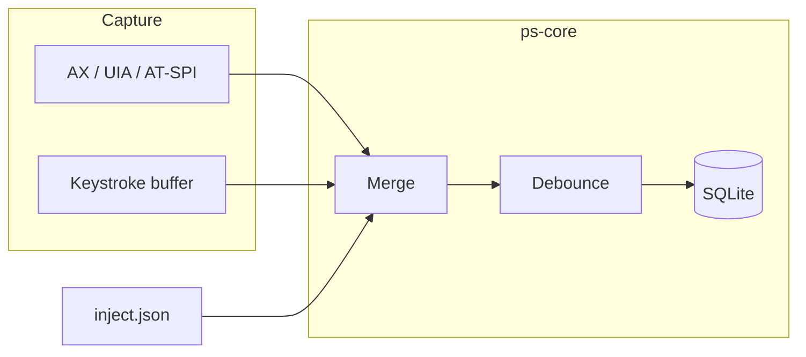

# Prompt Saviour

[](https://github.com/wangxuerui2003/prompt-saviour/actions/workflows/ci.yml)
[](https://github.com/wangxuerui2003/prompt-saviour/actions/workflows/release.yml)
[](LICENSE)

> Local-only desktop app that backs up in-progress coding agent prompts and helps you recover them after a crash.

Works with GUI chat apps (Cursor, VS Code, etc.) and terminal CLIs (Codex, Claude Code, etc.).
Nothing leaves your machine.

---

## At a glance

| | macOS | Windows | Linux |
|---|:---:|:---:|:---:|
| GUI app (Tauri) | yes | yes | yes |
| CLI (`prompt-saviour`) | yes | yes | yes |
| GUI text capture (AX / UIA / AT-SPI) | yes | yes | yes |
| Terminal keystroke capture | yes | yes | yes* |
| System tray + global hotkey | yes | yes | yes |

\* Wayland sessions may restrict global keystroke hooks; GUI capture and the inject channel still work.

---

## Install

Pre-built installers are attached to each [GitHub Release](https://github.com/wangxuerui2003/prompt-saviour/releases).

| Platform | Download | Notes |
|----------|----------|-------|
| macOS (Apple Silicon) | `.dmg` (aarch64) | Grant Accessibility + Input Monitoring |
| macOS (Intel) | `.dmg` (x86_64) | Same permissions as above |
| Windows | `.msi` | UI Automation + input hook; Defender may prompt once |
| Linux | `.deb` or `.AppImage` | AT-SPI session recommended |

Each release also ships a standalone **CLI binary** (`prompt-saviour-cli-*`) for headless or scripting use.

> Builds are unsigned by default.
> macOS Gatekeeper and Windows SmartScreen may show a one-time warning until the project adds code signing.

---

## Quick start

### GUI (recommended)

1. Install from a release above, or build locally (see [Development](#development)).
2. Open **Permissions** and grant access to the exact binary path shown.
3. Type in your agent app as usual - drafts save automatically to `~/.prompt-saviour/`.

Default hotkey: `Cmd+Shift+R` / `Ctrl+Shift+R` to open the window.

### CLI only

```bash
# Check permissions
prompt-saviour doctor

# Start capture daemon (foreground)
prompt-saviour run

# List / recover saved prompts
prompt-saviour list
prompt-saviour recover          # latest → clipboard
prompt-saviour recover 42       # by id

# No permissions required
prompt-saviour smoke --text "hello from smoke test"
```

---

## How it works



- **Dual-track capture**: read focused text from the GUI layer; fall back to keystrokes in terminals.
- **Debounce**: only writes when content actually changes (no duplicate rows).
- **Local storage**: `~/.prompt-saviour/drafts.db` + `config.json`.
  Override with `PROMPT_SAVIOUR_HOME`.

---

## Development

**Requirements**: Rust stable, Node 20+, platform SDK deps for Tauri 2.

```bash
git clone https://github.com/wangxuerui2003/prompt-saviour.git
cd prompt-saviour

# CLI
cargo build --release

# GUI
cd crates/ps-gui && npm install
npm run tauri dev
```

### Tests

```bash
cargo test --workspace
bash scripts/e2e.sh
```

See [docs/development/testing.md](docs/development/testing.md) for platform-specific live capture scripts.

### Project layout

```
crates/ps-core/     merge, debounce, storage, config
crates/ps-macos/    macOS Accessibility capture
crates/ps-windows/  Windows UI Automation capture
crates/ps-linux/    Linux AT-SPI capture
crates/ps-input/    shared keystroke listener
crates/ps-daemon/   CLI binary
crates/ps-gui/      Tauri 2 desktop app
```

---

## Documentation

| Topic | Link |
|-------|------|
| Full docs index | [docs/README.md](docs/README.md) |
| GUI product spec | [docs/product/gui-app.md](docs/product/gui-app.md) |
| macOS permissions | [docs/permissions/macos.md](docs/permissions/macos.md) |
| Windows permissions | [docs/permissions/windows.md](docs/permissions/windows.md) |
| Linux permissions | [docs/permissions/linux.md](docs/permissions/linux.md) |
| CLI reference | [docs/cli/reference.md](docs/cli/reference.md) |
| Roadmap | [docs/roadmap.md](docs/roadmap.md) |

---

## Contributing

Issues and pull requests are welcome.
Read [CONTRIBUTING.md](CONTRIBUTING.md) before opening a PR.

---

## License

[MIT](LICENSE)
