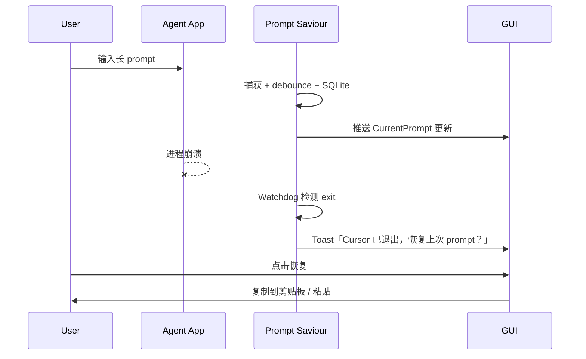

# GUI / App 规格

本文定义跨平台 Prompt Saviour **桌面 App** 的信息架构与功能要求。
当前仓库仅有 CLI POC；GUI 为下一阶段主要交付物。

## 技术方向（推荐）

| 层 | 选型 | 理由 |
|----|------|------|
| UI Shell | **Tauri 2** | 跨 macOS/Windows、系统托盘、小体积 |
| 核心逻辑 | 现有 `ps-core` Rust | 复用 Merge / Storage / Debounce |
| macOS 捕获 | `ps-macos` | 已有 AX + rdev |
| Windows 捕获 | `ps-windows`（待建） | UIA + WH_KEYBOARD_LL |
| 前后端通信 | Tauri commands + 事件推送 | 实时 prompt 预览 |

备选：Electron（与 Cursor 同栈，但体积大）。

## App 形态

- **Menu Bar / System Tray 常驻**（默认开机自启，可关）
- **主窗口**（点击托盘图标打开，或全局热键 `⌘⇧R` / `Ctrl+Shift+R`）
- **无 Dock 常驻**（可选：仅 tray）
- 安装包：macOS `.dmg` / `.app`，Windows `.msi` 或 NSIS

CLI `prompt-saviour` 保留为 power-user / 脚本接口，与 GUI 共用同一 `ps-core` 与数据目录。

---

## 信息架构

```
Prompt Saviour App
├── 仪表盘（默认页）
├── 当前 Prompt（实时）
├── 历史 Drafts
├── 权限与系统
├── 设置
└── 关于
```

---

## 1. 仪表盘

**目的**：一眼掌握运行状态。

| 元素 | 内容 |
|------|------|
| 保护状态 | 运行中 / 已暂停 / 权限缺失 |
| 当前前台 App | 名称、bundle id、窗口标题 |
| 当前 Prompt 摘要 | 最近捕获文本前 120 字 + 字符数 |
| 最后保存时间 | 相对时间（「3 秒前」） |
| 快捷操作 | 暂停保护、打开历史、复制最新 draft |

---

## 2. 当前 Prompt（核心页）

**目的**：GUI 内实时展示「现在正在输入、尚未提交」的内容。

### 必须展示

| 字段 | 说明 |
|------|------|
| **完整 prompt 文本** | 等宽字体、可滚动、可选 word wrap |
| 字符 / 行数 | 实时更新 |
| 来源 App | Cursor、Codex App、iTerm2 等 |
| 窗口标题 | 区分多窗口 |
| 捕获来源 | `accessibility` / `keystroke` / `merged` 标签 |
| 置信度 | 高（AX 完整读到的 GUI）/ 中（Keystroke）/ 低（兜底） |
| 最后更新时间 | 毫秒级 debounce 后的展示时间 |
| 是否已落盘 | 「已自动保存到本地」指示 |

### 必须支持的操作

- **复制到剪贴板**
- **导出为 `.txt`**
- **固定此 draft**（pin，避免被 prune）
- **手动标记为已提交**（从「当前」移到历史，停止继续 merge 到此 slot）

### 实时更新

- Daemon 每 100–500ms 通过 IPC / Tauri event 推送 `CurrentPromptSnapshot` 到 UI
- 修饰键操作（Cmd+V、Option+Backspace）后 UI 应在 200ms 内反映 AX 重读结果

### 空状态

- 无 focus 文本域：「等待你在 Agent 输入框中开始输入…」
- 文本过短（< 8 字符）：「继续输入，达到 8 字符后自动保护」

---

## 3. 历史 Drafts

**目的**：崩溃后或非崩溃场景下浏览、恢复任意 draft。

| 功能 | 说明 |
|------|------|
| 列表 | 时间倒序；App 名、字符数、来源、预览 |
| 搜索 | 按内容 / App 名过滤 |
| 详情 | 全文只读 + 复制 + 模拟粘贴（可选） |
| 删除 | 单条 / 批量 / 清空 |
| 恢复 | 复制到剪贴板；可选「粘贴到前台窗口」 |

与 CLI `list` / `recover` 读写同一 SQLite 数据库。

---

## 4. 权限与系统（必须内嵌）

**目的**：用户 never 需要查文档才知道怎么授权。

### macOS 权限卡片

| 权限 | UI 状态 | 引导动作 |
|------|---------|----------|
| Accessibility（辅助功能） | ✅ 已授权 / ❌ 缺失 | 「打开系统设置」深链 + 显示**当前 App 二进制路径** |
| Input Monitoring（输入监控） | ✅ / ❌ | 同上 |
| Automation（可选，仅 live 测试） | ✅ / ❌ | 说明用于 E2E，非必需 |

每个卡片包含：

- 一句话说明「为什么需要」
- **Copy Path** 按钮（复制 `.app` 或 binary 路径）
- **Refresh** 重新检测
- 截图示意（可选，设置页折叠）

### Windows 权限卡片（规划）

| 权限 | 说明 |
|------|------|
| UI Automation | 读 GUI textarea |
| 管理员 / 签名 | 部分 Hook 场景说明 |
| 开机自启 | Task Scheduler 或 Registry |

### 系统信息

- 数据目录路径（可打开文件夹）
- 数据库大小、draft 条数
- Daemon 进程 PID、运行时长
- 日志查看（最近 200 行）

---

## 5. 设置

| 设置项 | 默认 | 说明 |
|--------|------|------|
| 开机自启 | 开 | LaunchAgent / Task Scheduler |
| 捕获暂停 | 关 | 全局暂停，tray 图标变灰 |
| AX 轮询间隔 | 400 ms | 对应 `ax_poll_ms` |
| 落盘 debounce | 500 ms | 对应 `debounce_ms` |
| 保留天数 | 30 | |
| 最大 draft 数 | 500 | |
| 排除 App | `[]` | bundle id 黑名单 |
| 全局热键 | ⌘⇧R | 打开主窗口 / picker |
| 崩溃 Toast | 开 | watchdog 检测 agent 异常退出 |
| 恢复动作 | 复制到剪贴板 | 或一键粘贴 |

---

## 6. 关于

- 版本号、Git commit（构建时注入）
- 开源协议 MIT
- 链接：文档、Issue、检查更新

---

## 崩溃恢复 UX（GUI）



Toast 要求：

- 非模态、5 秒自动收起
- 显示 App 名 + prompt 前 80 字
- 按钮：恢复 / Dismiss / 打开历史

---

## Tray / Menu Bar 菜单

- 打开 Prompt Saviour
- 当前 Prompt 预览（子菜单，单行 truncate）
- 复制最新 draft
- 暂停 / 恢复保护
- 权限状态（✅ / ⚠️）
- 退出

---

## 与 CLI 的关系

| CLI 命令 | GUI 等价 |
|----------|----------|
| `run` | App 启动后 daemon 自动运行 |
| `list` | 历史 Drafts 页 |
| `recover` | 历史详情 / Toast 恢复 |
| `doctor` | 权限与系统 页 |
| `status` | 仪表盘 + 设置 |
| `smoke` / `inject` | 开发者菜单（隐藏，Debug 构建） |

---

## 无障碍与国际化

- GUI 支持键盘导航
- 首版 UI 语言：英文 + 简体中文（跟随系统）
- 捕获内容不做语言假设（UTF-8）
